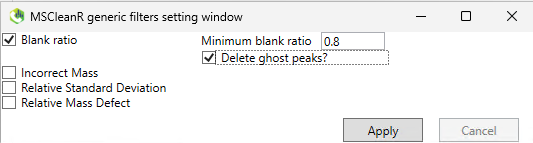
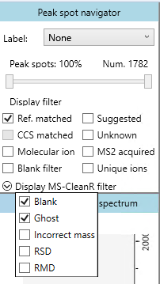
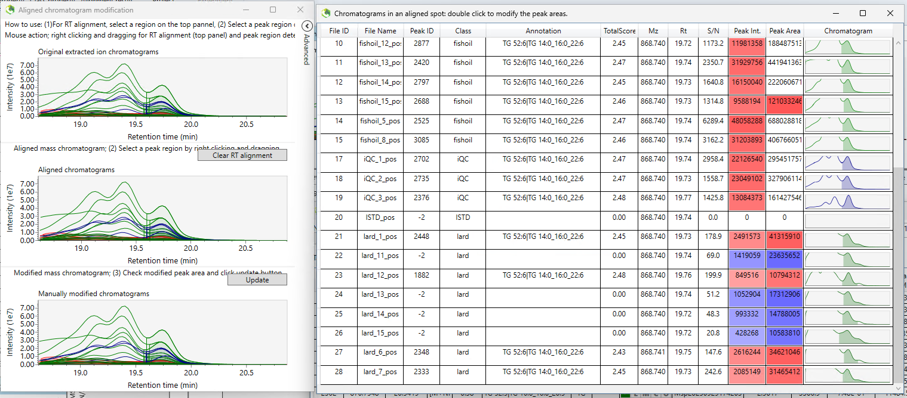
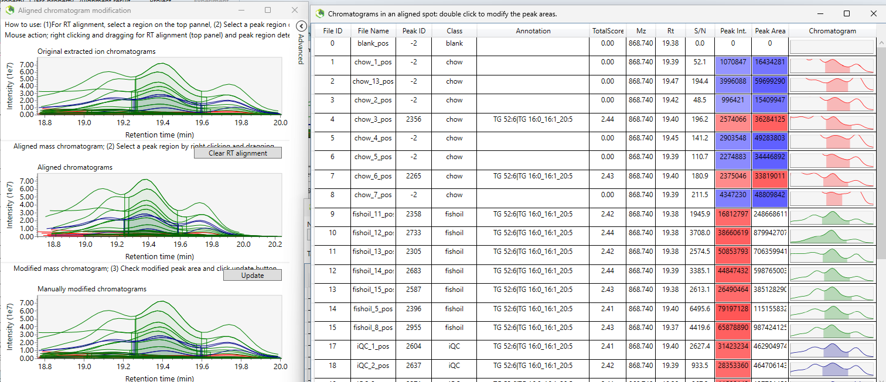
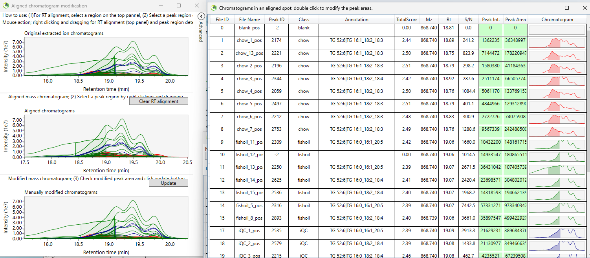
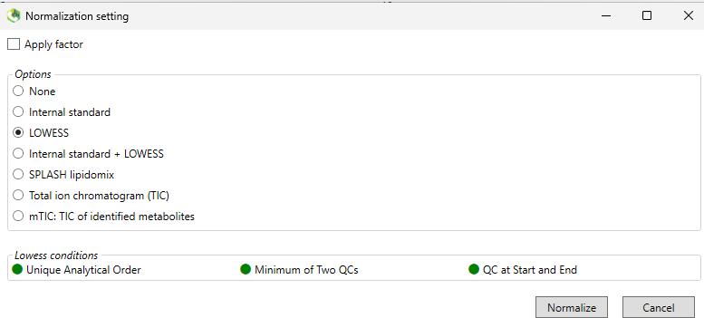

# Processing Demo Data in MS-DIAL for LipiRich

A step-by-step walkthrough of how to analyse the demo data provided in the [LipiRich GitHub repository](https://github.com/sarahehancock/LipiRich) using MS-DIAL 5, ready for import into LipiRich. Demo data were generated from mouse liver samples (n = 8 per group: chow, lard-based high-fat diet, and 90% fish oil high-fat diet). Animal and diet details are as previously described (Liu et al., 2014, *Scientific Reports* 4:5538, https://doi.org/10.1038/srep05538). Lipid extraction and LC-MS acquisition parameters are described in the Zenodo repository, DOI: [10.5281/zenodo.21448733](https://doi.org/10.5281/zenodo.21448733).

> For instructions on using the *already-processed* demo data directly in LipiRich, see the [main tutorial](../TUTORIAL.md). This page covers generating that processed data yourself, starting from the raw `.raw` files.

---

## Contents

- [Download MS-DIAL 5](#download-ms-dial-5)
- [Download the demo data](#download-the-demo-data)
- [Import files into MS-DIAL and set analysis parameters](#import-files-into-ms-dial-and-set-analysis-parameters)
- [Process files in MS-DIAL](#process-files-in-ms-dial)

---

## Download MS-DIAL 5

MS-DIAL 5 can be downloaded from its [GitHub repository](https://github.com/systemsomicslab/MsdialWorkbench). LipiRich was built and tested with **version 5.5.251021**. Following download, extract and run `MSDIAL.exe`.

## Download the demo data

The `.raw` files used in this tutorial can be downloaded from Zenodo, DOI: [10.5281/zenodo.21448733](https://doi.org/10.5281/zenodo.21448733).

## Import files into MS-DIAL and set analysis parameters

Below is a step-by-step walkthrough of how to analyse the positive ion demo data provided. Negative mode data can be analysed the same way, substituting the "negative" files/settings at each step.

### Set project parameters

Start a new analysis in MS-DIAL. The project title can be set as "Demo data pos.mdproject". The project file path should be set to the location of the `.raw` files downloaded from Zenodo. Click **Next**.

### Raw measurement files

Click **Browse** to open the directory where the `.raw` files are located. Change the file type to "Raw file(*.raw)". Upload all positive ionisation raw files (files ending in `_pos`). Click **Next**.

Set the sample type as "Sample" (samples), "Blank" (`blank_pos`), "Standard" (`IS_pos`), or "QC" (`iQC_x_pos`). Copy/paste "Class ID" and "Analytical order" from `Demo data metadata.xlsx` (available in this `demo_data/` folder). Ensure that "Acquisition" is set to "DDA". Click **Next**.

### Measurement parameters

The project name can be renamed here if desired. Leave all settings except "Target omics" as is. Change "Target omics" to "Lipidomics". Click **Next**.

### Data collection

Demo data processing settings (available in this `demo_data/` folder) can be loaded here under "Load parameter". This will load the settings shown in the screenshot below.

> **Note:** the number of threads should be changed based on the CPU speed of the computer the data is being analysed on.

### Peak detection

Minimum peak height was set as per [Determination of the optimal minimum peak height](https://systemsomicslab.github.io/msdial5tutorial/Determine%20the%20optimal%20minimum%20peak%20height.html), as described in the [MS-DIAL 5 tutorial](https://systemsomicslab.github.io/msdial5tutorial/).

### Identification

If the lipidomics library is not automatically loaded, click the plus symbol next to "Database setting" to add it. Change the database type to "Lbm". Under "Lipid database" click "Configure lipid class". Change the solvent type to "HCOONH4" using the dropdown.

Click "Remove all", then select the following lipid classes:

| Positive | Negative |
|---|---|
| CAR [M+H]+ | FA [M-H]- |
| LPC [M+H]+ | PA [M-H]- |
| LPE [M+H]+ | PC [M+HCOO]- |
| PC [M+H]+ | PE [M-H]- |
| PE [M+H]+ | PG [M-H]- |
| PG [M+NH4]+ | PI [M-H]- |
| PI [M+NH4]+ | PS [M-H]- |
| PS [M+H]+ | CL [M-H]- |
| CL [M+NH4]+ | EtherPC [M+HCOO]- |
| EtherPC [M+H]+ | EtherPE [M-H]- |
| EtherPE [M+H]+ | EtherPS [M-H]- |
| SM [M+H]+ | EtherPI [M-H]- |
| NAE [M+H]+ | EtherPG [M-H]- |
| DG [M+NH4]+ |  |
| EtherDG [M+NH4]+ |  |
| TG [M+NH4]+ |  |
| EtherTG [M+NH4]+ |  |
| CE [M+NH4]+ |  |
| Cer_NS [M+H]+ |  |
| Cer_NDS [M+H]+ |  |
| HexCer_NS [M+H]+ |  |
| HexCer_NDS [M+H]+ |  |
| Hex2Cer [M+H]+ |  |
| ST [M+H-H2O]+ |  |

Internal standard [IS] libraries must also be added. Click the plus symbol again, this time choosing "msp" under database type. Browse to `Lipid_IS_pos.msp` (download from github) and click **Open**. Under "Annotation method" change "Retention time tolerance" to 1 min.

Under "Annotation cut off" change "Dot product score" and "Weighted dot product score" to 150, and "Reverse dot product score" to 300. Change "Minimum number of matched spectrum" to 1. Under "Retention time setting" check "Use retention time for scoring". Finally, under "Annotation method setting" click on the Lipid_ISTD_pos library and use the up arrow to move it to the top.

### Adduct ion

If not already checked, select the following molecular species as included:

| Positive | Negative |
|---|---|
| [M+H]+ | [M-H]- |
| [M+NH4]+ | [M+HCOO]- |
| [M+H-H2O]+ |  |

### Alignment parameters

Enter the alignment parameters as shown in the screenshot below. The reference file should be set as the middle iQC (`iQC_2_pos`). When finished, click **Run**.

## Process files in MS-DIAL

### Filter data

Once processing has finished, double-click on the AlignmentResult in "Alignment navigator" (bottom left) to load the aligned results.

On the "Data visualisation" tab, click "MS-CleanR peak filtering". Check "Blank ratio", enter "Minimum blank ratio" as 0.8, and check "Delete ghost peaks?". Click **Apply**.

Under "Peak spot navigator", check "Ref. match". Click the down arrowhead next to "Display MS-CleanR filter" and check "Blank" and "Ghost".

### Manually check and align peaks

Click on the Peak spot table. Sort the table by "Annotation method". Check that all internal standards have been detected from the `Lipid_IS_pos.msp` file.

If manual alignment is required, open the "EIC of aligned spot" tab at the top. Right-click and select "Peak curation (EICs overlay)" or "Peak curation (Sample table)" to manually align peaks.

EICs overlay allows manual alignment across multiple files.

Sample table allows manual alignment of individual files. Double-click on the chromatogram to perform manual peak picking.

Also check the MS/MS representative vs. reference window in the bottom right pane, to confirm the detected MS/MS spectrum matches the reference.

When you are satisfied with the alignment and identity, click the checkmark under "Tag".

Resort the Peak spot table by Metabolite name, and sequentially work your way down the list of detected metabolites, confirming the identity of each one. Mark the checkmark under "Tag" as you confirm species.

### Example of incorrect identification

An example of an incorrect identification of CL 69:5 can be seen in the screenshot below. The alignment looks good, but the retention time is much earlier than other CL species, and the representative MS/MS does not match the reference spectrum. It is likely that this misidentified species is a phospholipid dimer rather than a cardiolipin. This species remains unchecked and will not be exported with the final alignment result.

### Other common issues

Isomeric TG peaks are often detected as poorly resolved peaks. MS-DIAL usually does a reasonable job deconvoluting them, but manual peak selection is sometimes required. The Annotation listed in the Sample table can help determine which peak belongs to which species. In the example below, three isomeric TG species are poorly resolved: TG 14:0_16:0_22:6 (1), TG 16:0_16:1_20:5 (2), and TG 16:1_18:2_18:3 (3). Inspection of the annotation for each chromatogram shows species (1) is the last peak, species (2) is the middle peak, and species (3) is the first peak.

Species (1):

Species (2):

Species (3):

Sample outliers can also affect the ability to align peaks correctly. Samples can be "turned off" post-alignment using "File property setting" under the "Option" tab.

### Normalising data

If analytical order is entered and QC samples are at the beginning and end of the sample acquisition, LOWESS normalisation can be performed. Under the "Data visualization" tab, click "Normalization". Select LOWESS and click "Normalise".

### Exporting alignment result

Once lipid species have been aligned, they can be filtered using the "Tag filter" in the Peak spot table.

Under the "Export" tab, click "Alignment result". Browse to the directory where you want the alignment result saved, and click "Select folder". Ensure the correct alignment file is set to be exported. Check "Filtering by current parameter" to ensure only Tag-filtered species are exported. If data are aligned, choose "Normalise data (Area)" to export.

Click **Export** to export the data. The aligned file can then be imported into LipiRich for background correction, normalisation to internal standards, statistics, data visualisation, and pathway enrichment analyses.

---

## Reference

> Liu, M., Montgomery, M.K., Fiveash, C.E., Osborne, B., Cooney, G.J., Bell-Anderson, K., Turner, N. (2014). PPARα-independent actions of omega-3 PUFAs contribute to their beneficial effects on adiposity and glucose homeostasis. *Scientific Reports* 4, 5538. https://doi.org/10.1038/srep05538
